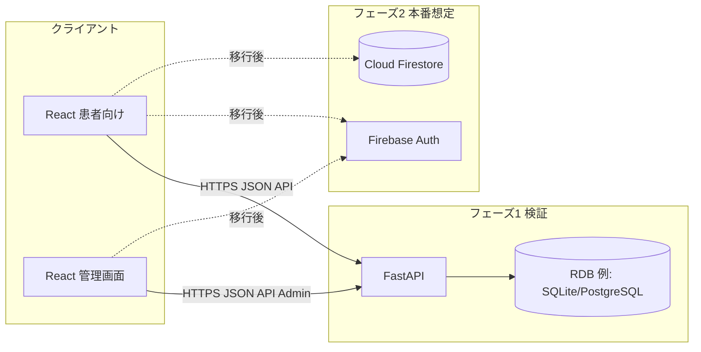
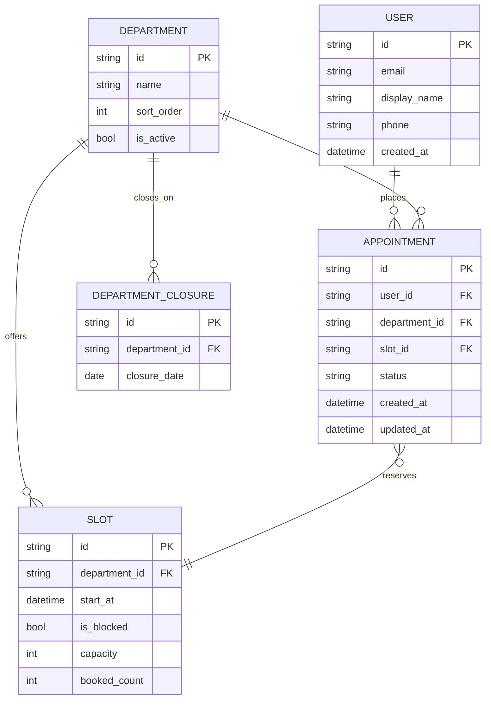

# 病院予約カレンダーアプリ 基本設計書

| 文書ID | HOSP-CAL-BD-001 |
|--------|-----------------|
| 版数 | 1.2 |
| 作成日 | 2026-04-07 |
| 最終更新 | 2026-04-07 |
| 参照 | 01_要件定義書.md |

---

## 1. 概要

### 1.1 システム構成

本システムは **患者向け SPA（React）**、**管理画面 SPA（React）**、および **バックエンドAPI** により構成する。フェーズ1では **FastAPI** が API を提供し、フェーズ2では **Firebase**（Authentication および Firestore を中心）へ移行する。フロントエンドは API 抽象化層によりバックエンド実装を切り替え可能とする。

### 1.2 設計方針

- **診療科単位**で枠と予約を管理する。
- **認証済み利用者のみ**が自分の予約を CRUD できる。
- **初診・再診で画面フローを分けない**（同一予約フロー）。
- **確定中の予約は「同一診療科につき1件まで」**。**診療科が異なれば最大3件まで**同時保有可（＝最大3診療科×各科1件）。新規登録API・DB制約で強制する。
- **管理画面**は患者アプリとURL・認証を分離し、診療科／枠／**休診**／**枠止め**を運用する。
- **予約枠は1時間単位**（`end_at = start_at + 1時間`）。マスタ生成・シードもこれに合わせる。
- **予約変更は同一診療科内で日時（枠）のみ変更可**（診療科の切替は不可）。
- **認証はメールアドレス＋パスワードのみ**（ソーシャル・SMS等は使わない）。
- **高齢者配慮**: デフォルトで大きめのタイポグラフィ、主要ボタンを画面下部付近に配置しやすいレイアウト方針とする（詳細は詳細設計・UIガイド）。

---

## 2. 機能モジュール構成

| モジュール | 責務 |
|------------|------|
| 認証（患者） | ログイン、ログアウト、トークン更新、登録。 |
| 認証（管理） | 管理者ログイン・ログアウト、管理者JWT（またはセッション）発行。 |
| ユーザー | プロフィール取得・更新。 |
| マスタ参照 | 診療科一覧、空き枠照会（**休診日・枠止めを除外**）。 |
| 予約 | 登録、一覧、変更、削除（キャンセル）。 |
| 管理マスタ | 診療科の追加・編集・無効化。 |
| 管理枠・休診 | 1時間枠の生成・編集、**枠単位の受付停止**、**診療科×日の休診**登録。 |
| 管理予約 | 全予約検索、代行キャンセル等、**監査ログ記録**。 |
| 共通 | HTTP クライアント、エラー表示、ローディング、ルーティング。 |

---

## 3. 画面一覧（論理）

| 画面ID | 画面名 | 概要 |
|--------|--------|------|
| SC-01 | ログイン | **メールアドレス・パスワード**で認証。 |
| SC-02 | 新規登録 | **メールアドレス・パスワード**でアカウント作成。 |
| SC-03 | ホーム／ダッシュボード | 次の予約の要約、主要アクションへの導線。 |
| SC-04 | 診療科選択 | 予約フロー開始。 |
| SC-05 | 日付・枠選択 | カレンダーまたは日付リストから **1時間単位** の空き枠を選択。 |
| SC-06 | 予約確認 | 入力内容の確認と確定。 |
| SC-07 | 予約一覧 | 自分の予約一覧。 |
| SC-08 | 予約詳細 | 1件の内容表示、変更・削除入口。 |
| SC-09 | 予約変更 | **同一診療科のまま**別枠（日時）を選び更新。 |
| SC-10 | プロフィール | ユーザー情報の表示・編集。 |

### 3.1 管理画面一覧（論理）

| 画面ID | 画面名 | 概要 |
|--------|--------|------|
| AD-01 | 管理者ログイン | メール・パスワード（患者アカウント不可）。 |
| AD-02 | 管理ダッシュボード | メニュー、当日の休診・枠止めの概要（任意）。 |
| AD-03 | 診療科一覧・編集 | 追加・編集・表示順・有効／無効。 |
| AD-04 | 予約枠一覧・生成 | 期間・診療科・ルールによる1時間枠の一括生成、個別編集。 |
| AD-05 | 枠止め | 選択枠の受付停止／再開。 |
| AD-06 | 休診カレンダー | 診療科×日の休診登録・解除。 |
| AD-07 | 予約検索・運用 | 条件検索、詳細、代行キャンセル等（確認ダイアログ＋監査ログ）。 |

---

## 4. データモデル（概念）

### 4.1 ER（概念）

### 4.2 予約ステータス（案）

| 値 | 意味 |
|----|------|
| confirmed | 確定 |
| cancelled | キャンセル（利用者または運用） |
| completed | 来院済み（将来拡張・任意） |

---

## 5. API 方針（基本）

- **スタイル**: REST、JSON。
- **認証**: `Authorization: Bearer <token>`（FastAPI フェーズは JWT、Firebase フェーズは ID トークン）。
- **バージョニング**: パスに `/api/v1` を付与（詳細設計でエンドポイント一覧化）。

主要リソース:

- `/auth/*` … 患者 登録・ログイン・トークン（FastAPI 時）
- `/admin/auth/login` … 管理者ログイン
- `/admin/*` … 診療科・枠・休診・予約運用（**管理者認証必須**）
- `/users/me` … 自分のプロフィール
- `/departments` … 診療科一覧（患者向け・有効のみ）
- `/slots` … 空き枠照会（**休診日・`is_blocked` 枠は除外**）
- `/appointments` … 予約 CRUD（患者本人のみ）

Firebase 移行時は **Cloud Functions for Firebase** または **Firebase Auth 直接 + Firestore Security Rules** で同等操作を実現し、**管理者は Custom Claims** 等で `admin` ロールを付与して書き込みを制限する想定。

---

## 6. セキュリティ基本

| 項目 | 内容 |
|------|------|
| 通信 | TLS 必須。 |
| 認証情報 | パスワードは平文保存禁止（ハッシュ: bcrypt/Argon2 等）。**管理者用と患者用を別ストアに分離**。 |
| 認可 | 予約は `user_id` が一致する場合のみ参照・更新・削除可。`/admin/*` は管理者トークンのみ。 |
| 監査 | 管理画面の重要操作（休診登録、枠止め、代行キャンセル等）を **audit_logs** に記録。 |
| Firestore | 患者データは `request.auth.uid` と一致を要求。マスタ・休診・枠の書き込みは **admin のみ**。 |

---

## 7. バックエンド移行戦略（FastAPI → Firebase）

| 観点 | 方針 |
|------|------|
| フロント | `apiClient` をインターフェース化し、実装を `restAdapter` / `firebaseAdapter` に分割。 |
| データ | Firestore のコレクション名・フィールド名を詳細設計で RDB カラムと対応表化。 |
| 認証 | FastAPI の JWT 検証から Firebase ID トークン検証へ変更。 |
| トランザクション | 枠の残数更新は FastAPI では DB トランザクション、Firestore ではトランザクションまたは Callable Function。 |

---

## 8. エラー・メッセージ方針

- 利用者向けメッセージは **日本語の定型文**（コードはログ用に保持）。
- 409（競合）: 「この時間は埋まりました。別の時間を選んでください。」
- 400（科ごと1件）: 「この診療科では、すでに予約があります。」（`DEPARTMENT_APPOINTMENT_EXISTS`）
- 400（3科上限）: 「予約は、異なる診療科で同時に3件までです。」（`APPOINTMENT_LIMIT_REACHED`）
- 403: 「この操作はできません。」
- ネットワーク障害: 「接続できませんでした。しばらくしてからお試しください。」

---

## 9. 運用・デプロイ（概要）

| フェーズ | 想定 |
|----------|------|
| FastAPI | Docker またはローカル + 単一DB。環境変数で CORS・秘密鍵を注入。 |
| Firebase | Hosting（React 静的）+ Auth + Firestore +（必要に応じ）Functions。 |

---

## 10. 参照文書

- 01_要件定義書.md
- 03_詳細設計書.md（API・DB・コンポーネント詳細）
- 04_画面フロー図.md

---

## 改訂履歴

| 版数 | 日付 | 変更内容 |
|------|------|----------|
| 1.0 | 2026-04-07 | 初版作成 |
| 1.1 | 2026-04-07 | 同時予約3件上限、1時間枠、変更は時刻のみ、認証はメール＋パスワードのみを反映 |
| 1.2 | 2026-04-07 | 管理画面・管理者APIを追加。予約ルールを同一診療科1件・異なる診療科で最大3件に変更。休診・枠止めを追加。 |
