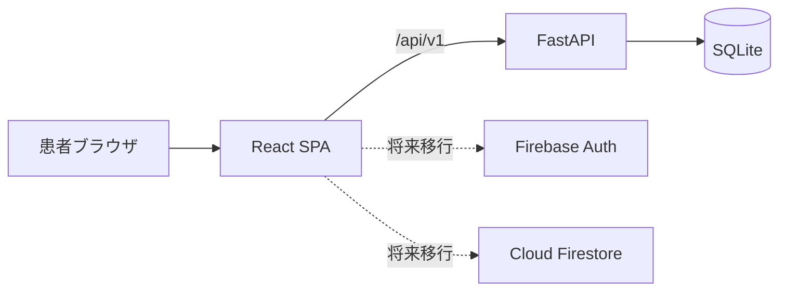
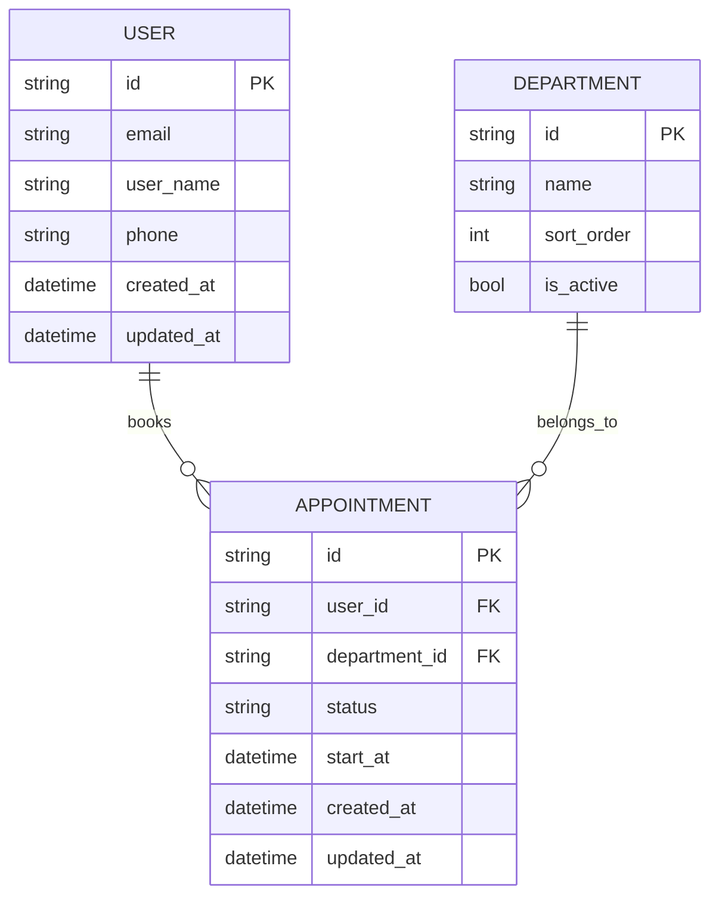

# 病院予約カレンダーアプリ 基本設計書

| 文書ID | HOSP-CAL-BD-001 |
|--------|-----------------|
| 版数 | 2.0 |
| 作成日 | 2026-04-07 |
| 最終更新 | 2026-04-09 |
| 参照 | 01_要件定義書.md |

---

## 1. 概要

本システムは、患者が自分で予約を登録・変更・確認できる Web アプリである。  
現在の構成は **React + FastAPI + SQLite** で、将来的に **Firebase** へ移行する前提で設計する。

現フェーズでは、患者向けの予約機能を優先し、管理者機能は後続フェーズとする。

---

## 2. システム構成

---

## 3. 設計方針

### 3.1 予約枠の考え方

- `Slot` テーブルは持たない
- 予約可能時間は DB に大量保存せず、日付選択時に動的生成する
- これにより、数か月先や年単位の予約可能期間にも対応しやすくする

### 3.2 ユーザー体験

- 大きめの文字とボタンを使う
- 操作の流れを短くする
- エラー時は「理由」を明確に表示する
- 各ページに戻る導線を持たせる

### 3.3 データ設計

- 予約は `department_id + start_at` で扱う
- `end_at` は固定 1 時間のためレスポンスで計算する
- キャンセルは物理削除とする

### 3.4 移行性

- フロントは REST API 前提で組み、後で Firebase Adapter に差し替えやすくする
- フィールド名は `snake_case` を基本にする

---

## 4. 機能モジュール

| モジュール | 役割 |
|------------|------|
| 認証 | 新規登録、ログイン、ログアウト、トークン保持 |
| ユーザー | 自分のプロフィール参照、更新 |
| 診療科 | 予約先の一覧表示 |
| 空き状況 | 日付ごとの予約可能時間生成 |
| 予約 | 一覧、詳細、登録、変更、削除 |
| 共通 UI | レイアウト、戻る導線、エラー表示、認証ガード |

---

## 5. 画面一覧

| 画面ID | 画面名 | 内容 |
|--------|--------|------|
| SC-01 | 公開トップ | ログインと新規登録の案内 |
| SC-02 | ログイン | 既存利用者向けログイン |
| SC-03 | 新規登録 | 初回利用者向け登録 |
| SC-04 | ホーム | 次の予約、診療科選択、プロフィール導線 |
| SC-05 | 新しい予約 | 日付選択と空き時間選択 |
| SC-06 | 予約一覧 | 予約一覧表示 |
| SC-07 | 予約詳細 | 1件の詳細、変更・キャンセル導線 |
| SC-08 | 予約変更 | 同じ診療科の中で日時変更 |
| SC-09 | プロフィール | 名前、電話番号の更新 |

---

## 6. 概念データモデル

---

## 7. 予約可能時間の設計

### 7.1 動的生成

予約可能時間は次の流れで作る。

1. 診療科を選ぶ
2. 日付を選ぶ
3. その日の基準時間帯を生成する
4. 既存予約と照合する
5. 満員や受付終了の時間に理由を付ける

### 7.2 現在の基準時間帯

| 曜日 | 時間 |
|------|------|
| 平日 | 09:00 / 10:00 / 11:00 / 13:00 / 14:00 / 15:00 / 16:00 |
| 土曜 | 09:00 / 10:00 / 11:00 |
| 日曜 | なし |

---

## 8. 予約制御の方針

| ルール | 内容 |
|--------|------|
| 同一診療科制限 | 同じ診療科に対して同時に複数の有効予約は不可 |
| 同時刻制限 | 同じ利用者が同じ時間に複数予約を持つことは不可 |
| 過去日時制限 | 過去日時には予約・変更できない |
| 診療科変更不可 | 変更では診療科を変えず、日時のみ更新する |
| 削除方式 | キャンセル時は DB から物理削除する |

---

## 9. API 方針

- ベースパスは `/api/v1`
- 認証は Bearer Token
- 一覧レスポンスは `{ "items": [...] }`
- 業務エラーは `{ "code": "...", "message": "..." }`

主な API:

- `/auth/register`
- `/auth/login`
- `/users/me`
- `/departments`
- `/availability`
- `/appointments`

---

## 10. フロントエンド設計方針

### 10.1 ルーティング

| パス | 内容 |
|------|------|
| `/` | 公開トップまたはログイン後ホーム |
| `/login` | ログイン |
| `/register` | 新規登録 |
| `/book/:departmentId` | 新しい予約 |
| `/appointments` | 予約一覧 |
| `/appointments/:appointmentId` | 予約詳細 |
| `/appointments/:appointmentId/edit` | 予約変更 |
| `/profile` | プロフィール |

### 10.2 認証ガード

- 未ログインで保護ページへ入った場合は `/login` へ遷移
- すでにログイン済みで `/login` や `/register` に入った場合は `/` に戻す

### 10.3 共通 UI

- `PageShell` で共通ヘッダと戻るボタンを提供する
- エラーメッセージは画面上部の Alert に表示する

---

## 11. セキュリティ方針

- パスワードはハッシュ化して保存する
- 自分の予約だけ取得・変更・削除できる
- トークン不正時はログイン画面へ戻す
- 将来 Firebase 移行時も、本人以外のデータに触れられないルールを維持する

---

## 12. 将来の拡張方針

今後追加する候補は次のとおり。

- 管理者画面
- 休診日管理
- 締切ルール
- 通知
- Firebase Adapter

これらは、患者向け API と UI の契約を崩さない形で追加する。

---

## 改訂履歴

| 版数 | 日付 | 変更内容 |
|------|------|----------|
| 1.0 | 2026-04-07 | 初版作成 |
| 2.0 | 2026-04-09 | slot 中心設計と未実装管理前提の記述を整理し、現行の患者向け Phase 1 実装に合わせて全面更新 |
