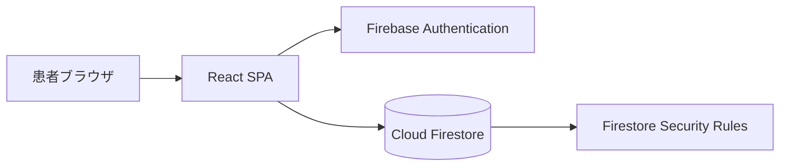
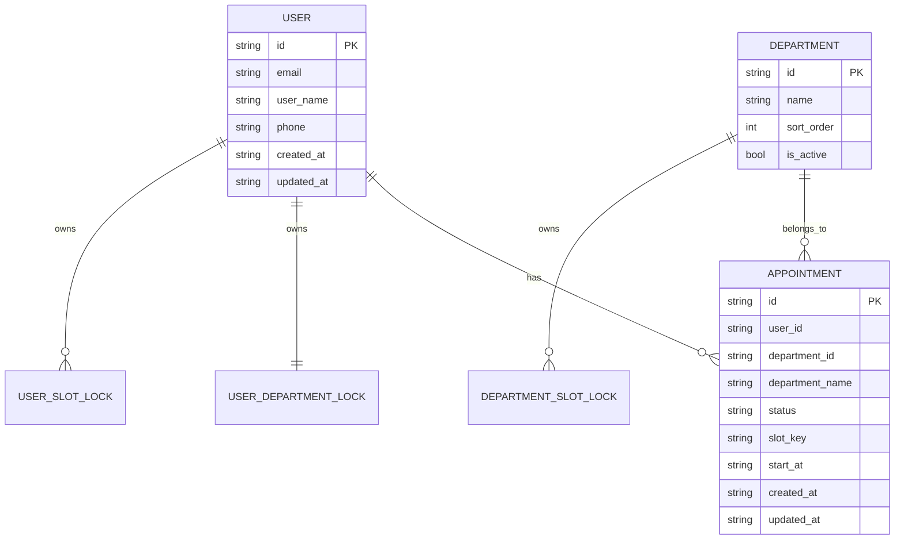

# 病院予約カレンダーアプリ 基本設計書

| 文書ID | HOSP-CAL-BD-001 |
|--------|-----------------|
| 版数 | 3.0 |
| 作成日 | 2026-04-07 |
| 最終更新 | 2026-04-09 |
| 参照 | 01_要件定義書.md |

---

## 1. 概要

本システムは、患者が自分で予約を登録・変更・確認できる Web アプリである。  
現在の構成は **React SPA + Firebase Authentication + Cloud Firestore** である。

---

## 2. システム構成

---

## 3. 設計方針

### 3.1 予約枠の考え方

- `Slot` テーブルは持たない
- 予約可能時間は日付選択時に動的生成する
- 数か月先まで大量の枠データを事前作成しない

### 3.2 ユーザー体験

- 大きめの文字とボタンを使う
- 戻る導線を共通化する
- エラー理由を日本語で表示する

### 3.3 データ整合性

- 予約は `department_id + start_at` を中心に扱う
- Firestore トランザクションで予約とロック文書を同時更新する
- `end_at` はレスポンスで計算する

### 3.4 セキュリティ

- 認証は Firebase Authentication を使う
- 本人データ以外へ触れられないよう Firestore Security Rules を設定する
- 現在の Rules はベースラインであり、より厳密な改ざん耐性が必要な場合は Cloud Functions 化を検討する

---

## 4. 主要モジュール

| モジュール | 役割 |
|------------|------|
| 認証 | 新規登録、ログイン、ログアウト、セッション監視 |
| ユーザー | 自分のプロフィール参照、更新 |
| 診療科 | 予約先の一覧表示 |
| 空き状況 | 日付ごとの予約可能時間生成 |
| 予約 | 一覧、詳細、登録、変更、削除 |
| 共通 UI | レイアウト、戻る導線、エラー表示、認証ガード |

---

## 5. 画面一覧

| 画面ID | 画面名 | 内容 |
|--------|--------|------|
| SC-01 | 公開トップ | ログインと新規登録の案内 |
| SC-02 | ログイン | 既存利用者向けログイン |
| SC-03 | 新規登録 | 初回利用者向け登録 |
| SC-04 | ホーム | 次の予約、診療科選択、プロフィール導線 |
| SC-05 | 新しい予約 | 日付選択と空き時間選択 |
| SC-06 | 予約一覧 | 予約一覧表示 |
| SC-07 | 予約詳細 | 1件の詳細、変更・キャンセル導線 |
| SC-08 | 予約変更 | 同じ診療科の中で日時変更 |
| SC-09 | プロフィール | 名前、電話番号の更新 |

---

## 6. 概念データモデル

---

## 7. Firestore コレクション設計

### 7.1 患者プロフィール

- `users/{uid}`

### 7.2 予約

- `users/{uid}/appointments/{appointmentId}`

### 7.3 診療科

- `departments/{departmentId}`

### 7.4 整合性維持用ロック

- `user_department_locks/{uid}_{departmentId}`
- `user_slot_locks/{uid}_{slotKey}`
- `department_slot_locks/{departmentId}_{slotKey}`

---

## 8. 予約可能時間の設計

| 曜日 | 時間 |
|------|------|
| 平日 | 09:00 / 10:00 / 11:00 / 13:00 / 14:00 / 15:00 / 16:00 |
| 土曜 | 09:00 / 10:00 / 11:00 |
| 日曜 | なし |

生成手順:

1. 診療科を選ぶ
2. 日付を選ぶ
3. 曜日に応じた候補時間を生成する
4. `department_slot_locks` を参照して満員判定する
5. 現在時刻以前は `受付終了` とする

---

## 9. フロントエンド設計方針

### 9.1 ルーティング

| パス | 内容 |
|------|------|
| `/` | 公開トップまたはログイン後ホーム |
| `/login` | ログイン |
| `/register` | 新規登録 |
| `/book/:departmentId` | 新しい予約 |
| `/appointments` | 予約一覧 |
| `/appointments/:appointmentId` | 予約詳細 |
| `/appointments/:appointmentId/edit` | 予約変更 |
| `/profile` | プロフィール |

### 9.2 認証ガード

- 未ログインで保護ページへ入った場合は `/login` へ遷移
- すでにログイン済みで `/login` や `/register` に入った場合は `/` に戻す

### 9.3 共通 UI

- `PageShell` で共通ヘッダと戻るボタンを提供する
- `LoadingState` でローディング中の高さ崩れを防ぐ
- エラーは画面上部 Alert で明示する

---

## 10. 補助ツール

- `firebase.json`
  - Hosting と Firestore Rules のデプロイ設定
- `firestore.rules`
  - ベースラインの権限制御
- `scripts/seed_firestore_departments.py`
  - 診療科の初期投入

---

## 改訂履歴

| 版数 | 日付 | 変更内容 |
|------|------|----------|
| 1.0 | 2026-04-07 | 初版作成 |
| 2.1 | 2026-04-09 | Firebase 切替構成へ更新 |
| 3.0 | 2026-04-09 | React + Firebase 直結構成へ全面更新 |
