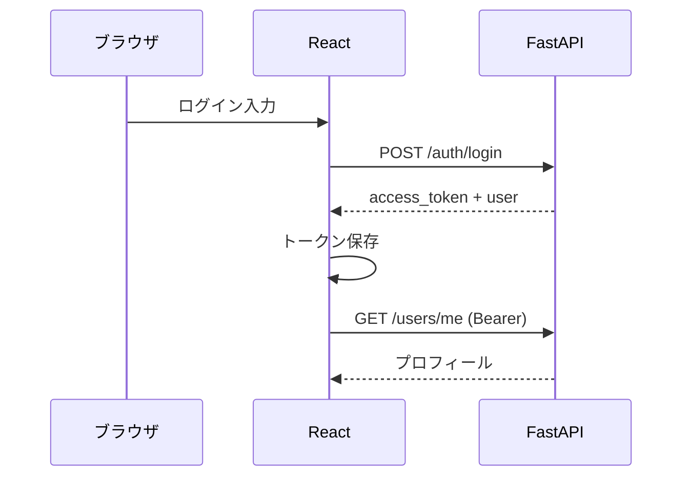

# 病院予約カレンダーアプリ 詳細設計書

| 文書ID | HOSP-CAL-DD-001 |
|--------|-----------------|
| 版数 | 1.2 |
| 作成日 | 2026-04-07 |
| 最終更新 | 2026-04-07 |
| 参照 | 01_要件定義書.md、02_基本設計書.md |

---

## 1. 概要

本書は FastAPI 検証フェーズを主として、REST API、データベース物理設計、React 構成、認証フロー、主要バリデーションを定義する。Firebase 移行時は **第7章** の対応表に従い実装を置換する。

---

## 2. REST API 詳細（FastAPI /api/v1）

### 2.1 共通

| 項目 | 仕様 |
|------|------|
| Base URL | `https://{host}/api/v1` |
| Content-Type | `application/json; charset=utf-8` |
| 認証ヘッダ | `Authorization: Bearer <access_token>`（公開エンドポイントを除く） |
| 日時形式 | ISO 8601（例: `2026-04-07T10:30:00+09:00`） |
| ID | UUID 文字列 |

### 2.2 エンドポイント一覧

#### 認証（フェーズ1）

| メソッド | パス | 認証 | 説明 |
|----------|------|------|------|
| POST | `/auth/register` | 不要 | 新規登録。**メール・パスワードのみ**必須。access_token / refresh_token（任意）を返す。 |
| POST | `/auth/login` | 不要 | ログイン。**メール・パスワード**。 |
| POST | `/auth/refresh` | リフレッシュトークン | アクセストークン再発行（実装する場合）。 |

**POST /auth/register リクエスト例**

```json
{
  "email": "user@example.com",
  "password": "********"
}
```

登録直後の `users` 行は `display_name` をメールのローカル部や「ユーザー」等の仮値で埋め、**SC-10 プロフィール**で任意に更新する実装でもよい。

**レスポンス例（200）**

```json
{
  "access_token": "eyJ...",
  "token_type": "bearer",
  "expires_in": 3600,
  "user": {
    "id": "uuid",
    "email": "user@example.com",
    "display_name": "user",
    "phone": null
  }
}
```

#### ユーザー

| メソッド | パス | 説明 |
|----------|------|------|
| GET | `/users/me` | ログイン利用者のプロフィール取得。 |
| PATCH | `/users/me` | 表示名・電話番号等の更新（メール変更は別フロー推奨）。 |

**PATCH /users/me リクエスト例**

```json
{
  "display_name": "山田 太郎",
  "phone": "09087654321"
}
```

#### 診療科

| メソッド | パス | 説明 |
|----------|------|------|
| GET | `/departments` | `is_active=true` の診療科を `sort_order` 昇順で返す。 |

**レスポンス例**

```json
{
  "items": [
    { "id": "dept-uuid-1", "name": "内科", "sort_order": 10 },
    { "id": "dept-uuid-2", "name": "外科", "sort_order": 20 }
  ]
}
```

#### 空き枠

| メソッド | パス | 説明 |
|----------|------|------|
| GET | `/slots` | クエリ: `department_id`（必須）, `from_date`, `to_date`（ISO日付） |

**ビジネスルール**

- 各枠は **ちょうど1時間**（`end_at` は `start_at` の1時間後）。生成・シード・管理画面でこの不変条件を守る。
- **`is_blocked = false` の枠のみ**患者向けに返す（枠止め）。
- 枠の開始日が **`department_closures`** に登録された **該当診療科×日** に該当する場合は返さない（休診日）。
- `capacity > booked_count` の枠のみ返す、または全枠返して `available` フラグを付与する実装を選択（実装は一貫させる）。
- 過去の開始時刻は返さない。

**レスポンス例**

```json
{
  "items": [
    {
      "id": "slot-uuid",
      "department_id": "dept-uuid-1",
      "start_at": "2026-04-10T09:00:00+09:00",
      "end_at": "2026-04-10T10:00:00+09:00",
      "available": true
    }
  ]
}
```

#### 予約

| メソッド | パス | 説明 |
|----------|------|------|
| GET | `/appointments` | ログイン利用者の予約一覧。クエリ: `from_date`, `to_date`, `status`（任意）。 |
| POST | `/appointments` | 予約登録。 |
| GET | `/appointments/{id}` | 詳細（本人のみ）。 |
| PATCH | `/appointments/{id}` | **同一診療科内**で別 `slot_id`（日時のみ変更）。 |
| DELETE | `/appointments/{id}` | キャンセル（論理削除推奨）。 |

**POST /appointments リクエスト例**

```json
{
  "department_id": "dept-uuid-1",
  "slot_id": "slot-uuid"
}
```

**処理（サーバ側）**

1. トークンから `user_id` を取得。
2. 当該利用者に、申し込み先 `department_id` と同じ診療科の **`status = confirmed` 予約が1件でもあれば** **400**（`DEPARTMENT_APPOINTMENT_EXISTS`）。
3. 当該利用者の **`status = confirmed` 予約件数が既に3件** なら **400**（`APPOINTMENT_LIMIT_REACHED`）。  
   ※運用上、2.と3.は同時に満たせないが、**DBの部分一意索引**（後述）でも担保する。
4. `slot` の存在、`department_id` 一致、開始時刻が未来、`is_blocked = false`、当該診療科×日が **休診でない**、`available` を確認。枠の長さが **1時間** であることを検証してもよい。
5. トランザクション内で `appointments` 挿入と `slots.booked_count` インクリメント。
6. 一意制約違反・競合時は **409 Conflict**。

**PATCH /appointments/{id}**

```json
{
  "slot_id": "new-slot-uuid"
}
```

- 同一利用者・`confirmed` のみ。
- **新 `slot` の `department_id` は、当該予約の `department_id` と一致必須**。異なる場合は **400**（`DEPARTMENT_CHANGE_NOT_ALLOWED`）または **422**。
- 変更締切: 定数 `CANCEL_CHANGE_DEADLINE_HOURS`（例: 24）時間前より前のみ可、などをサーバで検証。

**DELETE /appointments/{id}**

- `status` を `cancelled` に更新し、枠の `booked_count` をデクリメント（トランザクション）。

### 2.3 HTTP ステータスとエラーボディ

```json
{
  "error": {
    "code": "SLOT_FULL",
    "message": "この時間は埋まりました。別の時間を選んでください。"
  }
}
```

| code 例 | HTTP | 用途 |
|---------|------|------|
| VALIDATION_ERROR | 422 | 入力不備 |
| UNAUTHORIZED | 401 | 未ログイン・トークン無効 |
| FORBIDDEN | 403 | 他人の予約操作 |
| NOT_FOUND | 404 | リソースなし |
| SLOT_FULL / CONFLICT | 409 | 枠競合・重複予約 |
| APPOINTMENT_LIMIT_REACHED | 400 | 確定予約が既に3件（異なる診療科の上限） |
| DEPARTMENT_APPOINTMENT_EXISTS | 400 | 同一診療科に確定予約が既にある |
| DEPARTMENT_CHANGE_NOT_ALLOWED | 400 | 変更で診療科を変えようとした |
| DEADLINE_PASSED | 400 | 変更・キャンセル締切超過 |

### 2.4 管理者 API（`/api/v1/admin`）

管理者用のベースパスは **`/api/v1/admin`** とする。いずれも **`Authorization: Bearer <admin_access_token>`** 必須（`/admin/auth/login` を除く）。患者用JWTでは **403** とする。

#### 管理者認証

| メソッド | パス | 認証 | 説明 |
|----------|------|------|------|
| POST | `/admin/auth/login` | 不要 | `email`, `password`。成功時に **管理者JWT**（クレームに `role=admin` 等）を返す。 |

#### 診療科（管理）

| メソッド | パス | 説明 |
|----------|------|------|
| GET | `/admin/departments` | 全件（無効含む）。 |
| POST | `/admin/departments` | 追加。 |
| PATCH | `/admin/departments/{id}` | 名称・`sort_order`・`is_active` 更新。 |

操作後 **audit_logs** に記録（作成・更新）。

#### 予約枠（管理）

| メソッド | パス | 説明 |
|----------|------|------|
| GET | `/admin/slots` | クエリ: `department_id`, `from_date`, `to_date`。`is_blocked` を含めて返す。 |
| POST | `/admin/slots/bulk` | ルール指定の一括生成（例: 診療科ID、開始日、終了日、曜日、開始時刻リスト、1時間枠、定員）。 |
| PATCH | `/admin/slots/{id}` | `capacity` 変更、`is_blocked` の切替（**枠止め**）等。 |

**枠止め**: `is_blocked=true` の枠は患者の `GET /slots` に出さず、新規予約も不可。既存予約がある場合は運用方針（代行キャンセル案内等）を画面で警告してもよい。

#### 休診（診療科×日）

| メソッド | パス | 説明 |
|----------|------|------|
| GET | `/admin/department-closures` | クエリ: `department_id`, `from_date`, `to_date`。 |
| POST | `/admin/department-closures` | `department_id`, `closure_date`（日付のみ、病院タイムゾーン基準）。重複は409。 |
| DELETE | `/admin/department-closures/{id}` | 解除。 |

休診日に既存予約がある場合は、一覧で警告し **AD-07** から代行キャンセル等を促す。

#### 予約（管理）

| メソッド | パス | 説明 |
|----------|------|------|
| GET | `/admin/appointments` | クエリ: 日付範囲、`department_id`、ステータス、患者メール等。 |
| POST | `/admin/appointments/{id}/cancel` | **代行キャンセル**（理由テキスト必須）。患者APIのDELETEと同等の状態更新＋枠カウント減。 **audit_logs 必須**。 |

---

## 3. データベース物理設計（RDB 例）

### 3.1 テーブル定義

#### users

| カラム | 型 | NULL | 説明 |
|--------|-----|------|------|
| id | UUID | PK | |
| email | VARCHAR(255) | NOT NULL, UNIQUE | |
| password_hash | VARCHAR(255) | NOT NULL | |
| display_name | VARCHAR(100) | NOT NULL | 登録時は仮値可、プロフィールで更新 |
| phone | VARCHAR(20) | NULL | 任意 |
| created_at | TIMESTAMPTZ | NOT NULL | |
| updated_at | TIMESTAMPTZ | NOT NULL | |

#### admin_users（管理者）

| カラム | 型 | NULL | 説明 |
|--------|-----|------|------|
| id | UUID | PK | |
| email | VARCHAR(255) | NOT NULL, UNIQUE | |
| password_hash | VARCHAR(255) | NOT NULL | |
| display_name | VARCHAR(100) | NULL | |
| created_at | TIMESTAMPTZ | NOT NULL | |
| updated_at | TIMESTAMPTZ | NOT NULL | |

#### departments

| カラム | 型 | NULL | 説明 |
|--------|-----|------|------|
| id | UUID | PK | |
| name | VARCHAR(100) | NOT NULL | |
| sort_order | INT | NOT NULL DEFAULT 0 | |
| is_active | BOOLEAN | NOT NULL DEFAULT true | |

#### slots

| カラム | 型 | NULL | 説明 |
|--------|-----|------|------|
| id | UUID | PK | |
| department_id | UUID | NOT NULL, FK | |
| start_at | TIMESTAMPTZ | NOT NULL | |
| end_at | TIMESTAMPTZ | NOT NULL | **常に start_at + 1時間**（アプリ・制約で保証） |
| capacity | INT | NOT NULL DEFAULT 1 | |
| booked_count | INT | NOT NULL DEFAULT 0 | |
| is_blocked | BOOLEAN | NOT NULL DEFAULT false | **true** で枠止め（患者向け非表示・予約不可） |

インデックス: `(department_id, start_at)`、`start_at`  
（任意）DBレベルで `end_at = start_at + 1h` を CHECK で表現するかはRDB製品に依存するため、アプリ層での検証を主とする。

#### department_closures（休診：診療科×日）

| カラム | 型 | NULL | 説明 |
|--------|-----|------|------|
| id | UUID | PK | |
| department_id | UUID | NOT NULL, FK | |
| closure_date | DATE | NOT NULL | 病院運用タイムゾーンの暦日 |
| reason | VARCHAR(500) | NULL | 表示用 |
| created_at | TIMESTAMPTZ | NOT NULL | |

制約: `UNIQUE (department_id, closure_date)`

#### audit_logs（監査）

| カラム | 型 | NULL | 説明 |
|--------|-----|------|------|
| id | UUID | PK | |
| admin_user_id | UUID | NOT NULL, FK | |
| action | VARCHAR(64) | NOT NULL | 例: `department.update`, `slot.block`, `closure.create`, `appointment.cancel_admin` |
| target_type | VARCHAR(64) | NOT NULL | 例: `department`, `slot`, `closure`, `appointment` |
| target_id | UUID | NULL | |
| payload_json | JSONB | NULL | 変更差分・理由等 |
| created_at | TIMESTAMPTZ | NOT NULL | |

#### appointments

| カラム | 型 | NULL | 説明 |
|--------|-----|------|------|
| id | UUID | PK | |
| user_id | UUID | NOT NULL, FK | |
| department_id | UUID | NOT NULL, FK | |
| slot_id | UUID | NOT NULL, FK | |
| status | VARCHAR(20) | NOT NULL | confirmed / cancelled |
| created_at | TIMESTAMPTZ | NOT NULL | |
| updated_at | TIMESTAMPTZ | NOT NULL | |

制約:

- `UNIQUE (user_id, slot_id)` で同一枠の二重予約を防止。
- **同一利用者・同一診療科・確定は1件まで**: PostgreSQL 等では部分一意索引  
  `CREATE UNIQUE INDEX ux_appt_user_dept_confirmed ON appointments (user_id, department_id) WHERE status = 'confirmed';`
- **確定予約は最大3件**: アプリ／API層で `COUNT(*) WHERE user_id AND status='confirmed'` により強制（3件超のINSERTを拒否）。部分一意索引と組み合わせて整合を取る。
- `CHECK (booked_count <= capacity)` はアプリ層とトランザクションで保証しても可。

---

## 4. React アプリケーション詳細

### 4.1 推奨ディレクトリ構成

```
src/
  api/           # fetch ラッパ、エンドポイント関数
  auth/          # AuthContext、トークン保持（memory + sessionStorage 等）
  components/    # 共通UI（Button, Layout, ErrorAlert）
  features/
    departments/
    slots/
    appointments/
    profile/
    admin/         # 管理画面用（診療科・枠・休診・予約検索）
  pages/         # ルート単位の画面
  routes/        # React Router 定義（患者用と admin 用を分割してもよい）
  hooks/
  types/         # TypeScript 型
```

### 4.2 ルーティング（例）

| パス | ページ | 要認証 |
|------|--------|--------|
| `/login` | SC-01 | 否 |
| `/register` | SC-02 | 否 |
| `/` | SC-03 | 是 |
| `/book` | SC-04～06（ステップ） | 是 |
| `/appointments` | SC-07 | 是 |
| `/appointments/:id` | SC-08 | 是 |
| `/appointments/:id/edit` | SC-09 | 是 |
| `/profile` | SC-10 | 是 |
| `/admin/login` | AD-01 | 否（管理者） |
| `/admin` | AD-02 以降 | 是（管理者トークン） |

未認証で保護ページにアクセスした場合は `/login` へリダイレクト（戻り先をクエリで保持 optional）。管理画面は **`/admin/login`** へリダイレクト。

### 4.3 状態管理

- サーバ状態: **TanStack Query（React Query）** 推奨（一覧・枠の再取得、楽観的更新の制御）。
- 認証状態: **Context** で `user` と `accessToken` を保持。

### 4.4 主要コンポーネント責務

| コンポーネント | 責務 |
|----------------|------|
| `DepartmentList` | 診療科一覧表示、選択で次ステップへ。 |
| `SlotCalendar` | 日付選択 + 時間リスト。高齢者向けにタップ領域 44px 以上を目安。 |
| `AppointmentList` | 予約カード一覧、空状態メッセージ。 |
| `AppointmentDetail` | 詳細表示、アクション（変更・キャンセル）。 |
| `ConfirmDialog` | キャンセル確認など。 |

### 4.5 バリデーション（クライアント）

- **登録・ログイン**: メール形式、パスワード最低文字数（例: 8）。
- **プロフィール**: 電話番号は数字ハイフン許容（任意項目）。
- 予約前に一覧APIで **確定件数・診療科** を表示し、**選択中の診療科に既に確定がある場合**や **3件確定済み**なら新規予約を抑止または説明表示してもよい。
- サーバの 422 メッセージをフィールド下に表示。

---

## 5. 認証フロー（FastAPI）



アクセストークン有効期限切れ時は 401 を受け、ログアウトまたはリフレッシュ（実装時）を実行。

---

## 6. Firestore 設計案（フェーズ2）

### 6.1 コレクション

| コレクション | ドキュメントID | 主なフィールド |
|--------------|----------------|----------------|
| `users` | Firebase Auth UID と同一推奨 | `email`, `displayName`, `phone`, `createdAt` |
| `departments` | UUID | `name`, `sortOrder`, `isActive` |
| `slots` | UUID | `departmentId`, `startAt`, `endAt`, `capacity`, `bookedCount`, `isBlocked` |
| `departmentClosures` | UUID | `departmentId`, `closureDate`, `reason`, `createdAt` |
| `appointments` | UUID | `userId`, `departmentId`, `slotId`, `status`, `createdAt`, `updatedAt` |
| `adminUsers` | UID | 管理者（Auth と別ドキュメントでも可） |
| `auditLogs` | auto | `adminUserId`, `action`, `targetType`, `targetId`, `payload`, `createdAt` |

### 6.2 セキュリティルール（要点）

- `appointments`: 読み取り・更新・削除は `request.auth != null && resource.data.userId == request.auth.uid`。
- `users`: 本人ドキュメントのみ読み書き。
- `slots` / `departments`: 認証ユーザ読み取り可、書き込みは管理者のみ（Custom Claims 等）。

予約作成は **Callable Function** または **トランザクション付きクライアント** で枠カウントの整合を取る。

---

## 7. FastAPI ↔ Firebase 対応表

| 概念 | FastAPI / RDB | Firebase |
|------|---------------|----------|
| 利用者ID | users.id | Auth UID |
| 認証 | JWT | ID Token |
| 予約作成 | POST + DB TX | Function or TX |
| 一覧 | GET /appointments | `where userId == uid` |
| CORS | FastAPI 設定 | Hosting 同一オリジン優先 |

---

## 8. テスト方針（抜粋）

| 種別 | 対象 |
|------|------|
| API | pytest + httpx: 登録、予約競合、**同一科2件目拒否**、**3件上限**、枠止め・休診日除外、管理API認可、PATCH時の診療科不一致、締切エラー |
| FE | React Testing Library: フォーム、ルーティングガード |
| E2E（任意） | Playwright: 予約フロー |

---

## 改訂履歴

| 版数 | 日付 | 変更内容 |
|------|------|----------|
| 1.0 | 2026-04-07 | 初版作成 |
| 1.1 | 2026-04-07 | 1時間枠、同時予約3件、変更は同一科・時刻のみ、認証はメール＋パスワードのみ |
| 1.2 | 2026-04-07 | 管理者API・DB（枠止め・休診・監査・admin_users）。予約ルールを同一診療科1件・最大3診療科に変更。 |
