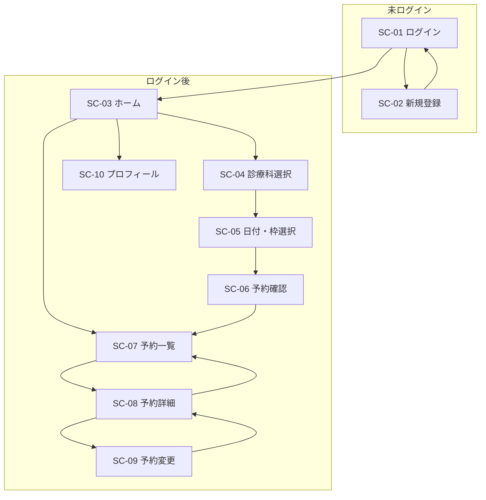
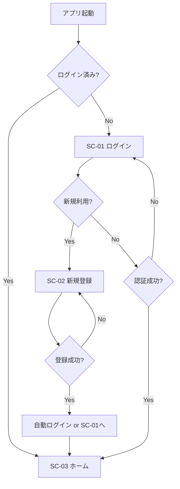
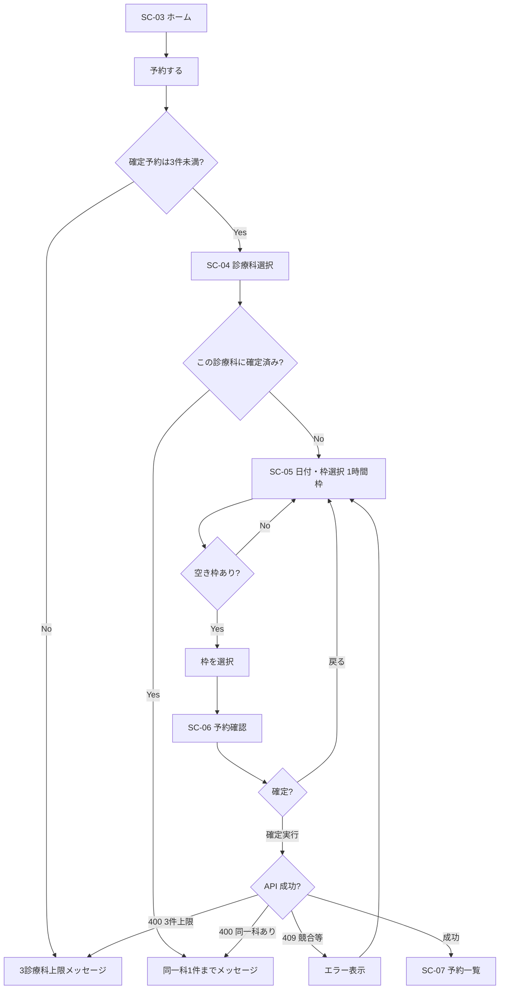
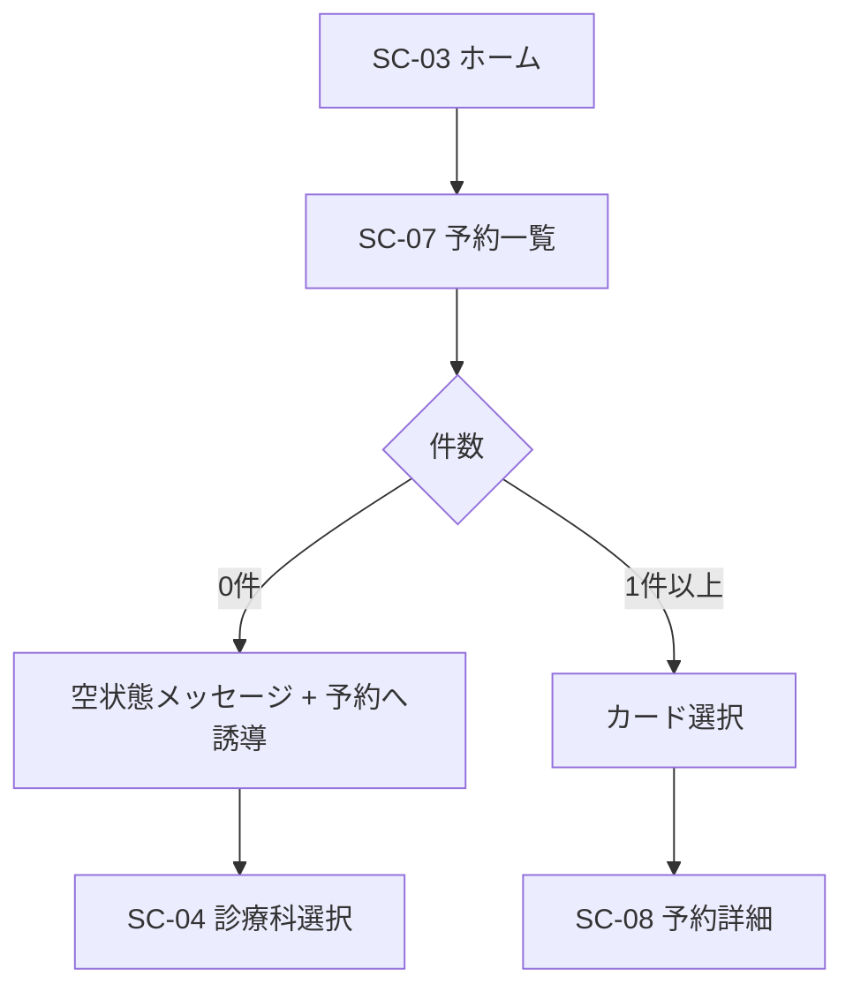
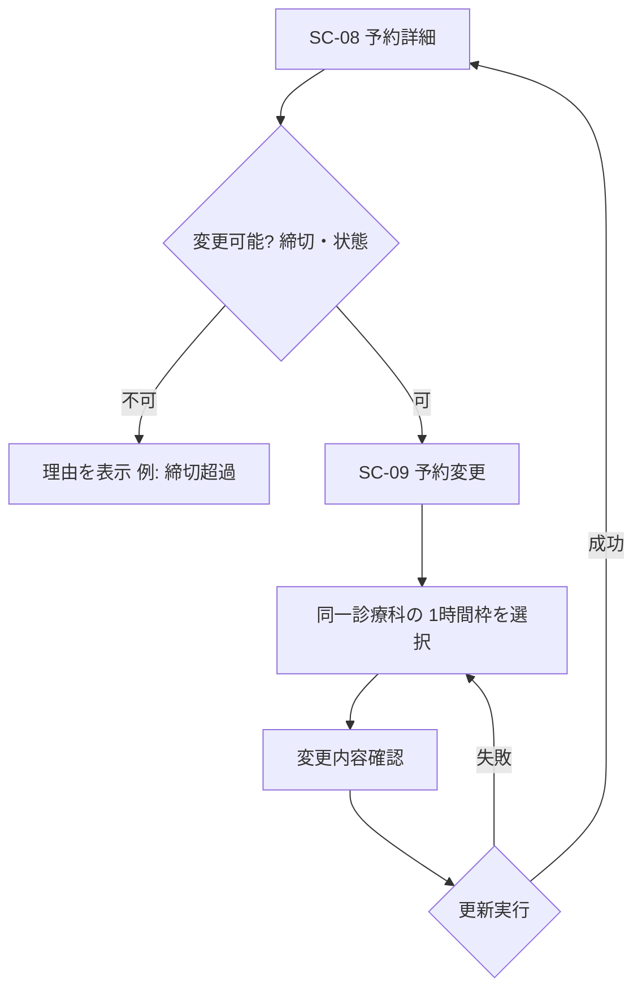
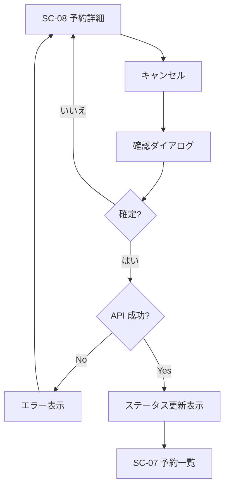
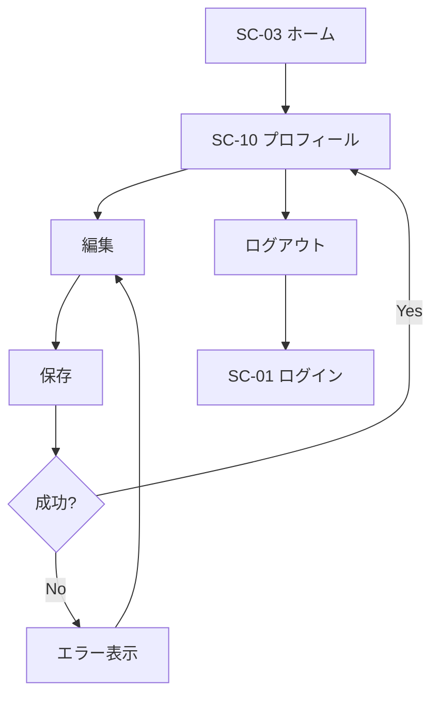
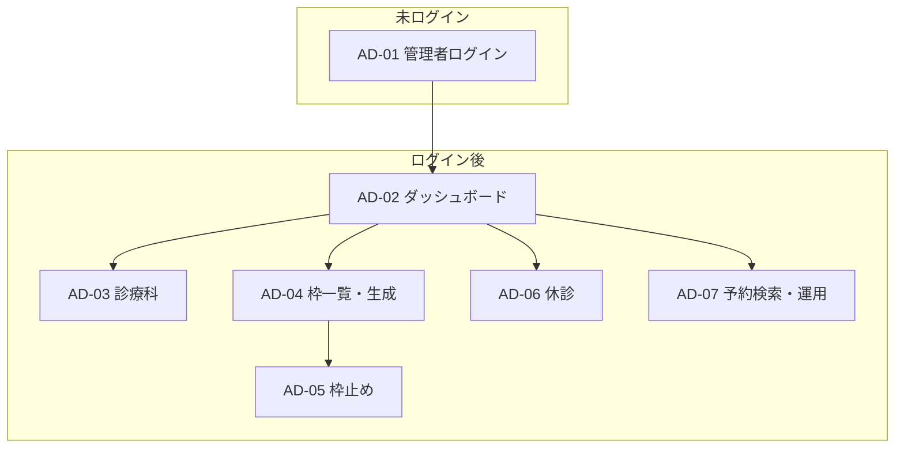
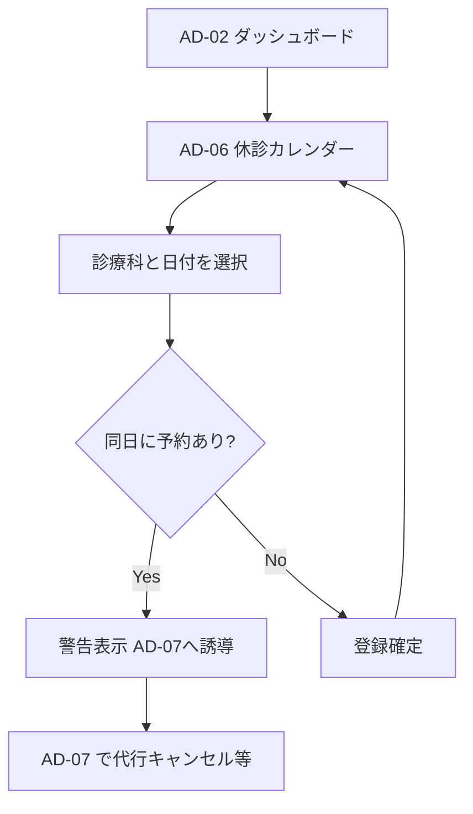
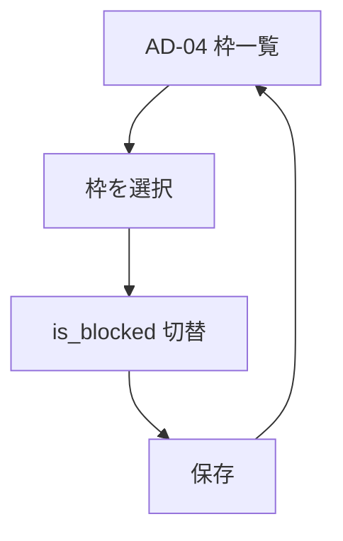

# 病院予約カレンダーアプリ 画面フロー図

| 文書ID | HOSP-CAL-SF-001 |
|--------|-----------------|
| 版数 | 1.3 |
| 作成日 | 2026-04-07 |
| 最終更新 | 2026-04-07 |
| 参照 | 02_基本設計書.md |

---

## 1. 概要

本書は患者向けおよび**管理画面**の主要シナリオにおける**画面遷移**と**分岐**を Mermaid で表現する。画面IDは基本設計書の画面一覧（SC-／AD-）に対応する。

---

## 2. 全体ナビゲーション（サイトマップ）

---

## 3. 新規登録〜初回ログイン

---

## 4. 予約登録フロー（閲覧の前提となる空き確認を含む）

初診・再診で分岐しない。

- **選択した診療科に、すでに確定予約がある**場合は新規不可（同一診療科は同時1件まで）。
- **確定予約が既に3件**（＝異なる診療科3件）のときは、4件目を拒否。

---

## 5. 予約閲覧フロー

---

## 6. 予約変更フロー

**診療科は変更しない。日時（1時間枠）のみ**選び直す。

---

## 7. 予約削除（キャンセル）フロー

---

## 8. プロフィール編集フロー

---

## 9. 管理画面ナビゲーション（サイトマップ）

---

## 10. 管理：休診登録フロー

---

## 11. 管理：枠止めフロー

---

## 12. 画面ID 早見表（患者）

| ID | 画面名 |
|----|--------|
| SC-01 | ログイン |
| SC-02 | 新規登録 |
| SC-03 | ホーム／ダッシュボード |
| SC-04 | 診療科選択 |
| SC-05 | 日付・枠選択 |
| SC-06 | 予約確認 |
| SC-07 | 予約一覧 |
| SC-08 | 予約詳細 |
| SC-09 | 予約変更 |
| SC-10 | プロフィール |

## 13. 画面ID 早見表（管理）

| ID | 画面名 |
|----|--------|
| AD-01 | 管理者ログイン |
| AD-02 | 管理ダッシュボード |
| AD-03 | 診療科一覧・編集 |
| AD-04 | 予約枠一覧・生成 |
| AD-05 | 枠止め |
| AD-06 | 休診カレンダー |
| AD-07 | 予約検索・運用 |

---

## 改訂履歴

| 版数 | 日付 | 変更内容 |
|------|------|----------|
| 1.0 | 2026-04-07 | 初版作成 |
| 1.1 | 2026-04-07 | 3件上限フロー、1時間枠、変更は同一科・時刻のみ |
| 1.2 | 2026-04-07 | 同一診療科1件＋最大3診療科の分岐を反映。管理画面フロー・AD一覧を追加。 |
| 1.3 | 2026-04-07 | エラー共通フロー（旧9章）を削除し章番号を繰り上げ。 |
