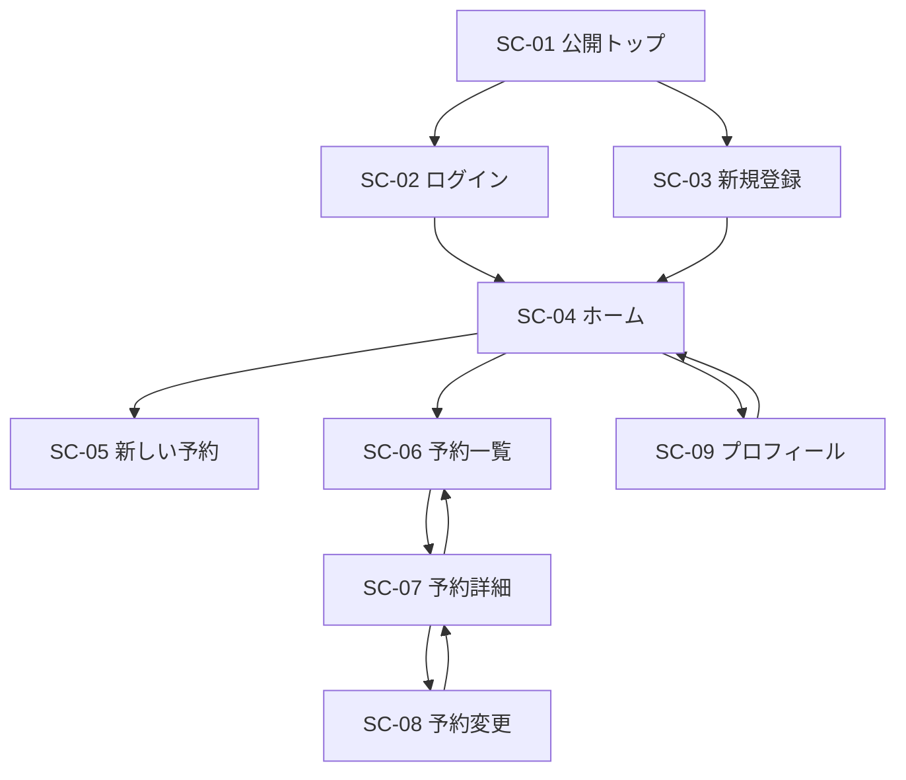
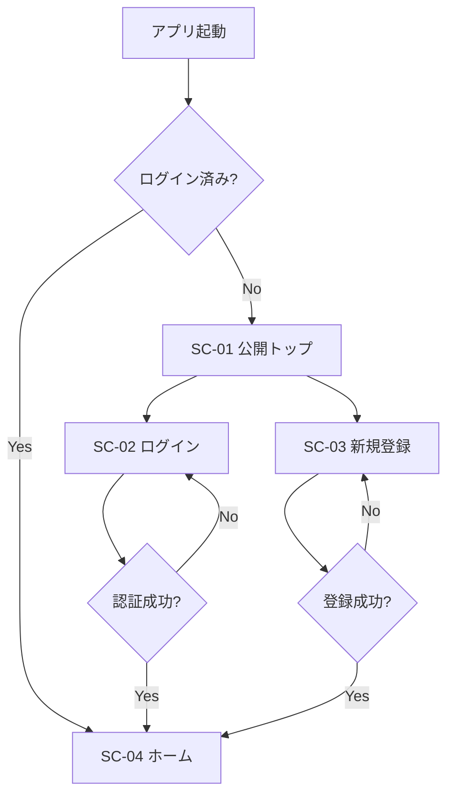
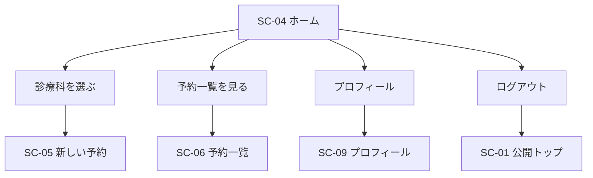
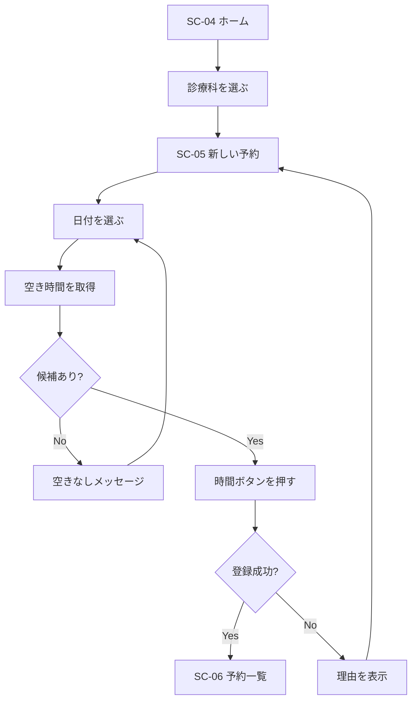
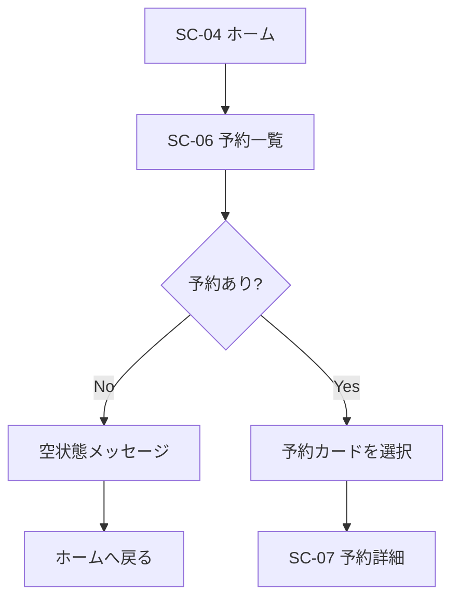
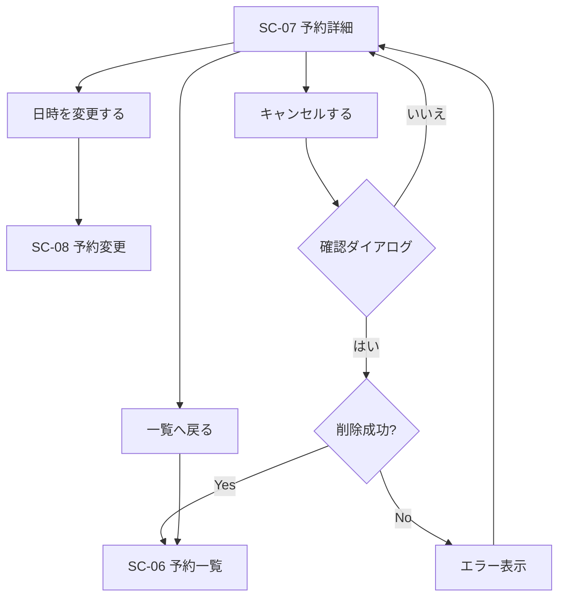
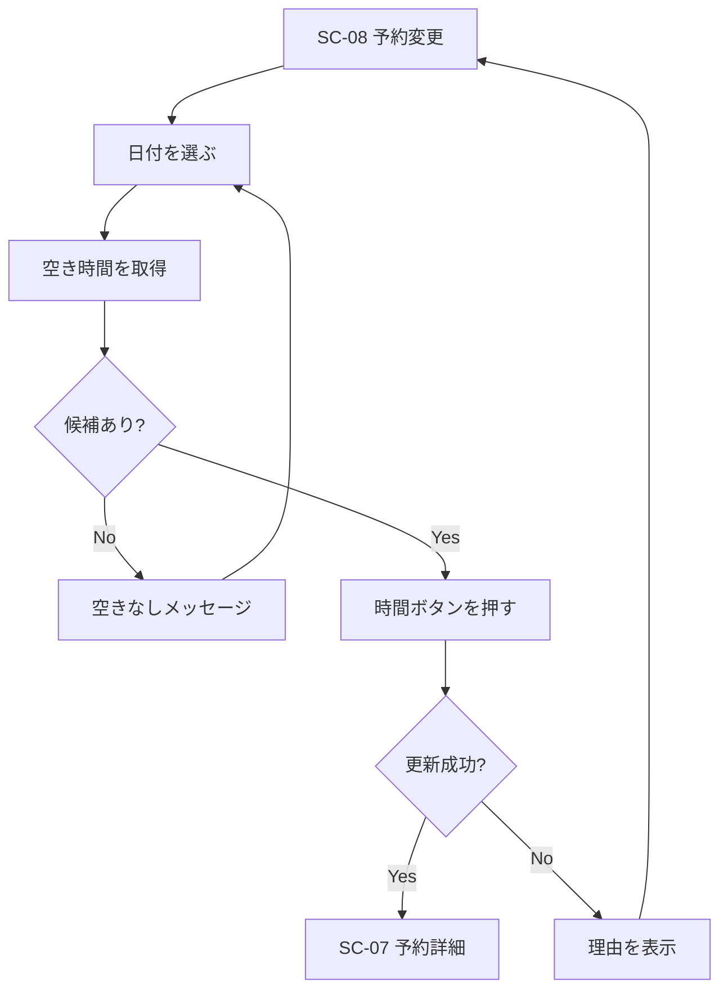
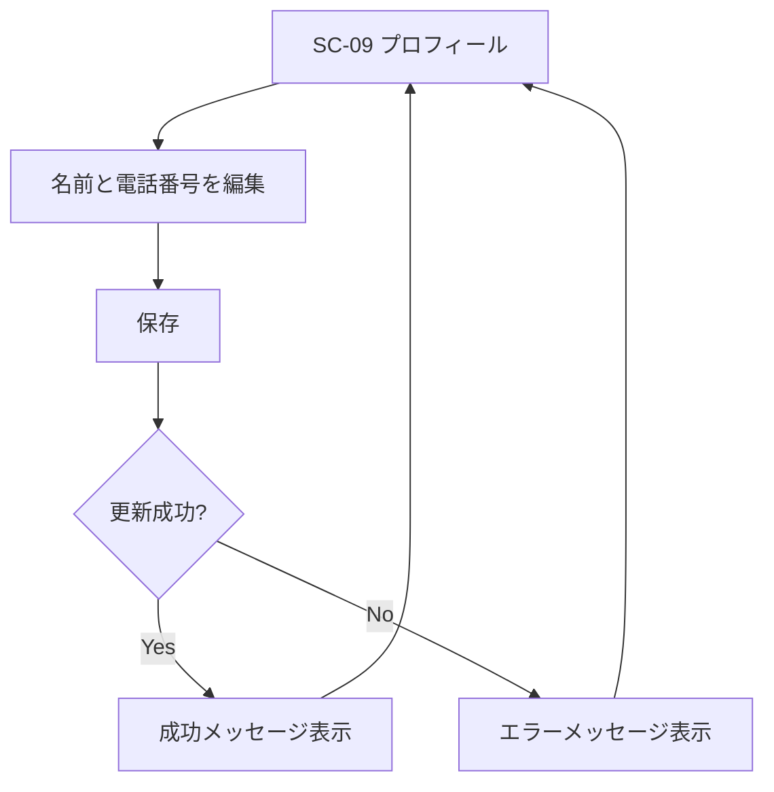

# 病院予約カレンダーアプリ 画面フロー図

| 文書ID | HOSP-CAL-SF-001 |
|--------|-----------------|
| 版数 | 2.0 |
| 作成日 | 2026-04-07 |
| 最終更新 | 2026-04-09 |
| 参照 | 01_要件定義書.md、02_基本設計書.md |

---

## 1. 概要

本書は、現在実装されている患者向け画面の遷移を整理したものとする。  
管理者画面は現フェーズでは未実装のため、本書では対象外とする。

---

## 2. 全体サイトマップ

---

## 3. 公開トップからログインまで

---

## 4. ホーム画面

ホームでは次の導線を持つ。

- 次の予約を見る
- 診療科から新しい予約を取る
- 予約一覧を見る
- プロフィールを見る
- ログアウトする

---

## 5. 新しい予約フロー

現在の実装では、確認ページを分けず、時間ボタンの押下で予約を確定する。

---

## 6. 予約一覧フロー

---

## 7. 予約詳細フロー

---

## 8. 予約変更フロー

---

## 9. プロフィール更新フロー

---

## 10. 戻るボタンの挙動

現在の実装では、共通レイアウト `PageShell` に戻るボタンを持たせている。

戻る先の優先順位:

1. ページごとに `backTo` が指定されている場合はそのページへ戻る
2. ブラウザ履歴がある場合は 1 つ前に戻る
3. 履歴がない場合は `/` に戻る

---

## 11. 画面 ID 一覧

| ID | 画面名 |
|----|--------|
| SC-01 | 公開トップ |
| SC-02 | ログイン |
| SC-03 | 新規登録 |
| SC-04 | ホーム |
| SC-05 | 新しい予約 |
| SC-06 | 予約一覧 |
| SC-07 | 予約詳細 |
| SC-08 | 予約変更 |
| SC-09 | プロフィール |

---

## 改訂履歴

| 版数 | 日付 | 変更内容 |
|------|------|----------|
| 1.0 | 2026-04-07 | 初版作成 |
| 2.0 | 2026-04-09 | 現在の患者向け画面構成に合わせて全面更新。slot 前提の予約確認フローや未実装管理画面中心の記述を整理 |
